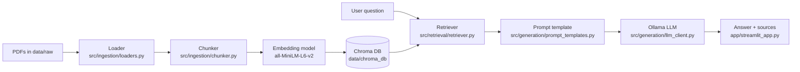

# RAG-system-for-study-notes
Implementing a RAG system on lectures and workshops to help with uni study (open-source)

Problem: I have too many lecture slides to study and not enough time to sift through them all let alone study them. I want to be able to ask questions and get answers based on the courses content

## Basic architecture
1. Ingest PDF lecture slides from `data/raw/`
2. Chunk the extracted text into manageable passages
3. Embed those chunks into vectors (`sentence-transformers/all-MiniLM-L6-v2`)
4. Store the vectors in a local Chroma vector database (`data/chroma_db/`)
5. Retrieve the most relevant chunks for a question via cosine similarity
6. Generate an answer using a local LLM (via [Ollama](https://ollama.com)), grounded strictly in the retrieved chunks
7. Chat with the system through a Streamlit UI, with retrieved sources shown alongside each answer



## Project structure
```
config.yaml               # reserved for app configuration (currently unused/empty)
requirements.txt          # Python dependencies
app/                       # Streamlit chat UI - see app/README.md
data/                      # raw PDFs, processed output, Chroma DB files - see data/README.md
scripts/                   # one-off/maintenance CLI scripts - see scripts/README.md
src/                       # core library: ingestion, embeddings, retrieval, generation, vector store
tests/                     # pytest test suite (currently placeholder files)
```

See the README in each top-level folder for details on that part of the system:
- [app/README.md](app/README.md)
- [data/README.md](data/README.md)
- [scripts/README.md](scripts/README.md)
- [src/README.md](src/README.md)
- [tests/README.md](tests/README.md)

## Prerequisites
- Python 3.10+
- [Ollama](https://ollama.com) installed and running locally, with at least one instruct model pulled (e.g. `ollama pull qwen2.5:7b-instruct`)

## Setup
```powershell
# from the project root
python -m venv .venv
.venv\Scripts\Activate.ps1
pip install -r requirements.txt
```

## Ingesting your lecture slides
1. Drop your PDF files into `data/raw/`.
2. Run the ingestion script, which loads every PDF, chunks it, embeds the chunks, and upserts them into the local Chroma collection `study-notes` (stored under `data/chroma_db/`):
   ```powershell
   python scripts/ingest_notes.py
   ```
   Re-running this fully rebuilds the `study-notes` collection from whatever PDFs currently exist in `data/raw/`.

## Running the app
```powershell
streamlit run app/streamlit_app.py
```
This opens a chat interface at `http://localhost:8501`. Ask a question about your slides; each answer is generated only from the retrieved chunks, and the exact chunks used (with source filename and similarity distance) are shown in a collapsible "Sources" section underneath the answer so you can verify grounding.

Make sure Ollama is running locally (`ollama serve`, or it's already running as a background service) before asking questions, since generation calls `http://localhost:11434`.

## Testing retrieval without an LLM
Before trusting the LLM output, you can sanity-check retrieval alone:
```powershell
python src/retrieval/retriever_test.py
```
This runs a handful of hardcoded questions through `query_chroma()` and prints the retrieved chunks with their similarity distance and source file, with no LLM involved.

## Configuration notes
- The embedding model (`all-MiniLM-L6-v2`) is shared between ingestion and retrieval — if you change one, change both, otherwise similarity scores become meaningless.
- The default LLM model used by `src/generation/llm_client.py` is `qwen2.5:7b-instruct`. Change `DEFAULT_MODEL` in that file (or pass `model=` to `generate()`) to use a different locally-installed Ollama model.
- `config.yaml` is currently unused; it's reserved for future externalized configuration (model names, chunk sizes, etc).

